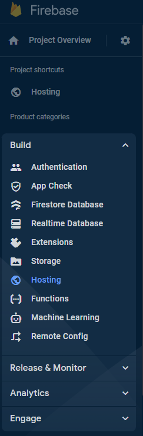
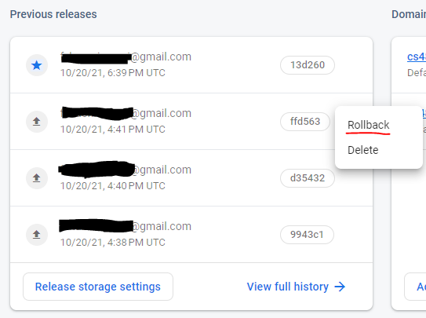

# Deploying Fatplants

Once the code has been tested and we're ready to push it to the live site, we can deploy Fatplants from the commandline using Firebase. 

## Prerequisites

### Installing and Updating the Firebase CLI

You should already have the Firebase CLI if you've run the project, but if not, you can install and update the CLI with:

```
npm install -g firebase-tools
```

This will globally install the CLI on your machine, or update it to the latest version.

### Logging into Firebase

Once again, this may be unnecessary if you've already run the project, but you will need to log into Firebase in the command line with:

```
firebase login
```

Follow the instructions using the Google account that you were added to the Firebase project with. 

## Initiate the Deployment

### Build the Site

There are two steps to deploying the site. First, you'll want to build out the Fatplants application. Before doing this, test the ENTIRE site, as you do not want to accidentally push any new bugs.

*(Side note, a known bug is that the datasets pages will crash when you refresh the page. This only happens when running the project locally and will not be an issue once you deploy).*

 Once you're certain its ready, run

```
ng build
```

This will generate the built version of the site in the "dist" directory. This process can take up to 30 minutes, so don't worry if its taking a while.

### Deploy the Built Site

Now you can begin the deployment. If you did not make any changes to the cloud functions in the functions folder, then you can run the following command to deploy:

**DID NOT MAKE CHANGES TO CLOUD FUNCTIONS**
```
firebase deploy --only hosting
```

This takes much less time than the following, which you need to run if you update any cloud functions:

**DID MAKE CHANGES TO CLOUD FUNCTIONS**
```
firebase deploy
```

Once this is finished, the new code will be live. If you don't see your changes, clear the cache or try incognito mode.

## Rolling Back Deployments

In the event that you accidentally deploy a bug or site-breaking change, don't panic. You can very easily rollback to a previous release while you fix the issue. Go to the Firebase console once again, and go to Build->Hosting.



Under previous releases, hover over the second one on the list (they're ordered by date). Click the three dots on the right, and select "Rollback".

