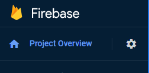
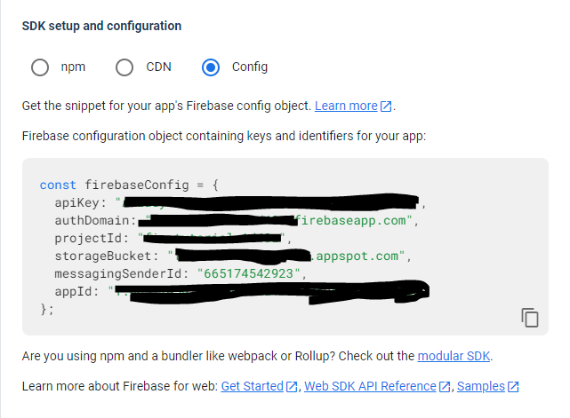

# Environment File Setup

In order to use the Firebase backend, as well as deployment and other core features of Firebase, a user must be logged in and have access to the project. We use a special API key to achieve this and it is stored in src/environments.

## Create the Files

First, clone the project repository to your machine. Then you'll go to the src folder in the Angular project. Create a folder called "environments". Then create two files: "environment.ts" and "environment.prod.ts". We don't use prod, but it still needs to be here.

These two files are not tracked by git, so they will not be included in your commits. This is intentional, as we don't want them on Github for someone else to access. Your API key is unique to you, and helps us identify who is deploying and pulling data from Firestore.

## Get Your API Key

You will need to be added to the Firebase project as a developer by Chunhui or someone with access to do so. This can be done with your school email, or a personal Google email. Once you've been added, you'll get an email with instructions to accept the invitation. 

Now go to [Firebase](firebase.google.com), and click "Go to Console" in the top right. You should see the project as one of the options (make sure you're signed into the account you were added to the project with). Click the project card to go to the main console page.

In the top left, find the settings icon. Click the icon, then click "Project settings".

.

In the General tab (which should be open by default), scroll down to the "Your apps" section. Under "SDK setup and configuration", click the radio button for "Config". The data below is what you'll need to copy for the environments file. Simply copy the entire firebaseConfig object, and paste it into your environments.ts file.



## Add the API Key to the File

Go back to environments.ts, and paste the config object into it. Change the object's name to "firebase", and add a variable called "production" with the value false. It should look like the following:

```js
// src/environments/environments.ts

const production = false;

const firebase = {
  apiKey: "<API KEY HERE>",
  authDomain: "<AUTH DOMAIN HERE>",
  projectId: "<PID HERE>",
  storageBucket: "<STORAGE BUCKET HERE>",
  messagingSenderId: "<MESSAGE ID HERE>",
  appId: "<APP ID HERE>"
};

```

Save the file, copy the text, and paste it into "environments.prod.ts". In this file, change the production variable to true.

```js
// src/environments/environments.prod.ts

const production = true;

const firebase = {
  apiKey: "<API KEY HERE>",
  authDomain: "<AUTH DOMAIN HERE>",
  projectId: "<PID HERE>",
  storageBucket: "<STORAGE BUCKET HERE>",
  messagingSenderId: "<MESSAGE ID HERE>",
  appId: "<APP ID HERE>"
};

```

Save the files, and you should be able to pull from the backend now.
